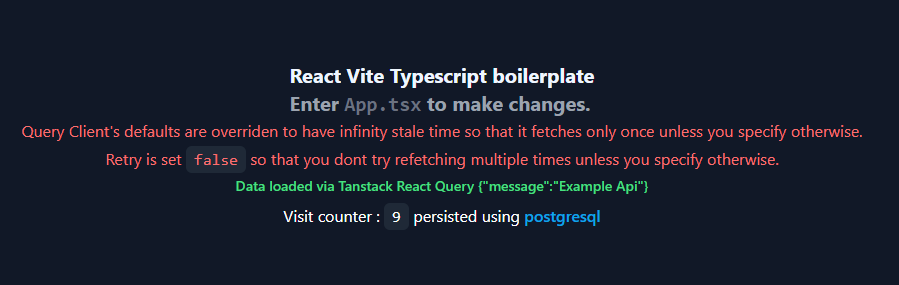

# Fullstack Typescript boilerplate with everything you could need to start that next project you had in mind for a long time.

## Tools

<section align="left">

</section>

## Features

## How To Start

